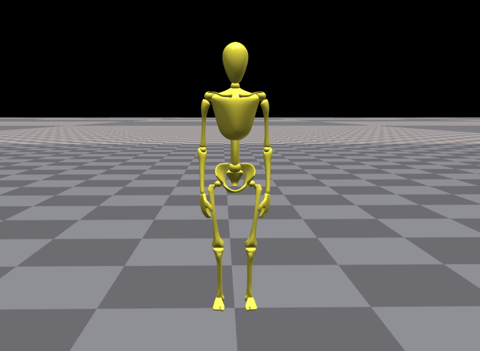
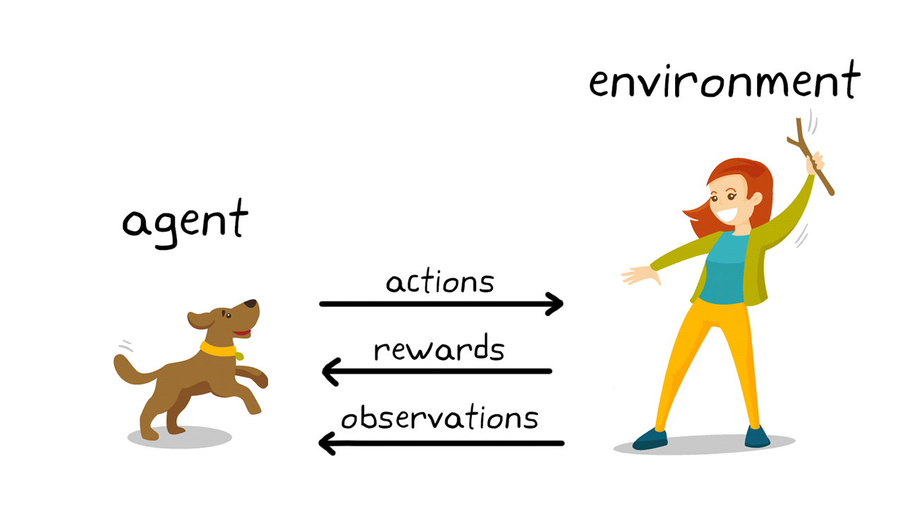
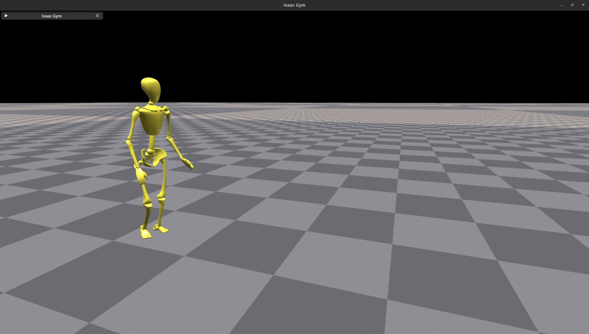

# Assignment 3 - Deep RL for Humanoid Motion Imitation

# 1. Overview
In this assignment, we will use deep reinforcement learning to train a control policy for a physically simulated humanoid character.
The character is simulated using the Isaac Gym physics engine.
The goal is to train the character to imitate a reference motion, similar to [DeepMimic]([https://arxiv.org/abs/1804.02717]) [1].
For example, imitating a cartwheel reference motion:


_\[ Green: reference motion, Gray: simulated character imitating the reference \]_

Let's start by introducing our humanoid character, *Bob* :



Bob has 32 degrees of freedom (DOF) and is controlled by 32 one-dimensional joints.
The root is assigned to the pelvis link.

We are provided a simple walking motion and a cartwheel motion for Bob.
Our goal is to use reinforcement learning to train a control policy that can imitate these motions in the physical environment.

Recall the general structure of a reinforcement learning problem:



For this task, we consider the following components:
* **Agent**: The control policy that maps observations to actions.
* **Environment**: The Isaac Gym physics engine, which simulates the humanoid character.
* **Actions**: The control inputs to the character. 
In this case, the actions are the target joint angles for the character. 
A low-level controller (e.g. a PD controller) will track these target angles to generate the actual torques applied to the character.
We will use IsaacGym in position mode, e.g. using the internal low-level controller.
* **Observations**: The observations are the inputs to the control policy and contain information about the state of the character.
The observation includes: 
  * base velocity (local)
  * base angular velocity (local)
  * joint angle offsets (joint angle - default joint angle)
  * joint velocities
  * base orientation (quaternion)
  * actions of the previous step
  * base height (global)
  * phase variable (more on that later)
* **Rewards**: The rewards are used to evaluate the performance of the agent and guide the policy. 
You will design the rewards for the tasks.

We use [Proximal Policy Optimization (PPO)](https://arxiv.org/abs/1707.06347) as the reinforcement learning algorithm.

The assignment is divided into two tasks:
* Task 1: Imitate a simple **walking** motion
   * 1.1: Implement the rewards for mimicing motion (20% shared with Ex. 2.2*)
   * 1.2: Implement phase variable (10%)
   * 1.3: Achieve a policy that mimics walking (30%)
* Task 2: Imitate a **cartwheel** motion
  * 2.1: Implement reference state initialization (10%)
  * 2.2: Adjust the rewards if needed (20% shared with Ex. 1.1*)
  * 2.3: Achieve a policy that mimics cartwheeling (30%)

*Exercises 1.1 and 2.2 will be graded together (in total 20%).

Please read carefully through the tasks and the training guides below.

# 2. Getting started
You need to have two development environments:
One local environment for you to start developing the rewards, and another environment on a cloud computing service for running Isaacgym.

## a. Setting up local environment
**[Do only once]**

This is the environment where you will be developing and testing the rewards on your personal PC or laptop.
We use `poetry` for managing python environment.
Please install poetry by following the instructions [here](https://python-poetry.org/docs/#installing-with-the-official-installer).

Go to `pyproject.toml` file and comment this line:
```p
isaacgym = { path = "isaacgym"} # comment this if on your local system
```

You should use `python==3.8` for this project.
We provide installation guide for Ubuntu here, for MacOS and Windows, please follow a similar procedure as in [Assignment 2](https://github.com/CMM-25/a2?tab=readme-ov-file#b-install-dependencies) (but use python3.8 instead).

Additional step for **Windows**: before running `poetry install`, go to `pyproject.toml` file and change the torch dependency to the one corresponding to windows.

For **Ubuntu**:
```bash
sudo add-apt-repository -y ppa:deadsnakes/ppa
sudo apt-get update
sudo apt-get install -y python3.8 build-essential python3.8-dev python3.8-distutils

cd a3 # or your own repo
poetry env use /usr/bin/python3.8
poetry install
```

## b. Connecting to remote server
Since Isaacgym requires powerful Nvidia gpus, we are using [Amazon Web Service (AWS)](https://aws.amazon.com/) servers for running our code.

You have been given a `<your_aws_key>.pem` file, a `<aws_gateway_key>.pem` file, a group id `<group-id>`, a public ip address `<your_instance_ip>` and a gateway ip `<gateway-ip>`.
You can use these to connect to a computer on the AWS server and use it for this assignment.

Each group can use one AWS instance for this project. You can think of an instance as a remote computer that you can connect to and use as if it was your own computer.
We use a shared gateway node `cmm-gateway` to start/stop AWS instances.

### Starting/Stopping your instance
1. Download and store your `pem` files in a folder on your personal computer. 
From the same folder, change the key permissions:
```
chmod 400 <path-to-aws-key>.pem
```
Do this for both the gateway key and your key.

2. Connect to cmm-gateway:
``` 
ssh -i <path-to-gateway-key>.pem ec2-user@<gateway-ip>
```
3. From the gateway, start your instance:
```
python3 aws-gateway/client.py start <group-id>
```
4. Exit gateway
```
exit
```
**Note:** Please note it might take a few minutes for the instance to be accessible after you start it.

**Note:** You can also replace **start** with **stop** or **reboot** to execute the respective commands to your instance. 
 To get the state of a running instance, use the **status** command.
You can also check your total usage time by using the **uptime** command.

### Connecting to your instance
After you have started the instance, you can connect to it from your personal computer:
```bash
ssh -i <path-to-your-aws-key>.pem ubuntu@<your-instance-ip>
```

### AWS usage guidelines 

* **Important:** Each group is eligible to use up to **20 hours** of AWS compute time. 
Please note that we are paying for the computing
resource and we expect you to respect this time constraint strictly. 
The 20 hours budget is sufficient for finishing this assignment. So please stop the instance whenever you are not
training, and do not use this service for matters irrelevant to this course. Non-compliance will
lead to consequences.
* AWS charging starts when you start the instance until you stop it. 
Please stop the instance if you are not using it. Our manager bot stops the instance automatically after **~1 hour** of inactivity. In that case, you need to start the instance again.
* Please only use commands with your own group id and respect others rights.
* Stopping the instance will terminate any process that is currently running, but it doesn't delete the files. However, we highly encourage you to keep constant backup of your files and push to the repo regularly to prevent any catastrophic loss.


## c. Setting ssh key for Github on the server
**[Do only once]**

To be able to access your github repo effectively, we recommend using a `ssh-key`.

From your **instance**, run:
```
ssh-keygen -t rsa -b 4096 -C "your_email@example.com"
```
When prompted to "Enter a file in which to save the key," press Enter to accept the default file location (`~/.ssh/id_rsa`).
You can skip the password for more simplicity.
Then print the public key:
```bash
cat ~/.ssh/id_rsa.pub
```
Copy the output, then go to your github repository of this assignment, go to `settings -> security -> deploy keys -> add deploy key` and paste the value.

You can add github as a host:
```bash
vim ~/.ssh/config
```
add the following to the file:
```bash
Host github.com
  HostName github.com
  User git
  IdentityFile ~/.ssh/id_rsa
```

## d. Setting up environment on the remote server
**[Do only once]**

After you have successfully connected to the server, you can do the following to prepare for running the scripts.
We provide you with a docker image that has all the necessary dependencies installed, including IsaacGym.

1. Clone your repository, and head to your desired branch.
```
git clone git@github.com:CMM-25/a3.git # use your own repository
```
2. Pull the docker container
```bash
docker pull fzargar75/animrl:latest
```
3. Open a tmux session. This allows you to have multiple command lines.
You can find useful tmux commands [here](https://tmuxcheatsheet.com/).
```bash
tmux
```
4. Run the docker container
```bash
docker run -it --gpus all --name cmm-docker -v /home/ubuntu/a3:/root/a3 fzargar75/animrl bash
```
and replace `a3` with your actual folder name.
After running this, you should be inside the docker container, you can verify that by seeing that the username has changed.

5. Make sure this line in the `pyproject.toml` is **uncommented**:
```
isaacgym = { path = "isaacgym"} # comment this if on your local system
```

6. Inside the docker container, install the package
```bash
cd /root/a3
pip install -e .
```

## e. Run your code on the server
If you are already inside the container, jump to step 2.

1. Start the docker container again
```bash
docker start cmm-docker
docker attach cmm-docker
```
2. You can now run the training script inside the container, with the desired arguments.
```bash
python animRL/scripts/train.py --task=walk --dv --wb
```

After a few seconds, you will see the training has started. 
You will be prompted to enter your Weights & Biases API key if using the `--wb` argument. Refer to [this section](#weights--biases) for more details.

You can optionally create a new tmux window to see the gpu usage by running `nvidia-smi`.

**Note:** To streamline working on a remote server, checkout [VS code's remote development plugin](https://code.visualstudio.com/docs/remote/ssh).

**Note:** The folder `a3` is always synced inside and out of the docker. So if you change the branch outside, your files inside the docker also change.

## f. Weights & Biases
You can monitor the training process using the Weights & Biases dashboard. 
You first need to create an account on [Weights & Biases](https://wandb.ai).

You will be prompted for your account when running the training script with the `--wb` argument. 
First, enter `2` to select using an already existing account.
Then you need to enter your API key, which you can find by going to [here](https://wandb.ai/authorize).
After you have entered your API key, you can monitor the training process on the Weights & Biases dashboard.

# 3. Task 1 - Imitate Walking
In this task, we will train Bob to imitate a simple walking motion.
The reference motion is provided in the `animRL/resources/datasets/bob3/Walk.txt`.
The motion looks like this:


## Ex. 1.1: Reward functions for motion imitation
The reward function is a crucial component of the reinforcement learning problem.
Typically, the reward function is a combination of several terms that encourage the agent to learn the desired behavior.
We use multiplication of several terms to get the final reward.

$ r = \prod r_i$

Since the main objective is to imitate the reference motion, the reward function should be designed to penalize the difference between the character's motion and the reference motion.
We can split this objective into several terms:

* **base height reward**: Encourages the character to match the reference height. This reward is provided for you as an example.
* **joint angle tracking reward**: Encourages the character to match the reference joint angles.
* **base orientation tracking reward**: Encourages the character to match the reference orientation for the base (root link).
* **base velocity reward**: Encourages the character to match the reference base velocity.
* **end effector position tracking reward**: Encourages the character to match the reference end effector positions.
* **joint target rate reward**: Penalizes large action changes to encourage smoother control.

Go to `animRL/reward/rewards.py`. 
This file contains the reward functions. You have to implement the reward functions in the class REWARDS.
The reward functions should return a tensor of shape `(num_envs,)` with the rewards for each environment.
You can then add the reward name to the config file (plus sigma and tolerance) in order to use that reward function. More info on that [here](#ex-13-training-and-tuning-hyperparameters).
You can use the sigma and tolerance values arbitrarily, however, we suggest to use an exponential kernel with sigma and optionally use tolerance to allow for small deviations.
The data dictionary has information about the environment and the current state of the agent. 

You can find where you need to write your code by looking for `TODO 1.1`.
You can use the test script `animRL/scripts/test_reward.py` in your **local** environment to see the output of your reward functions for a small set of observations.
You can specify the task `walk` and do two tests, one with data coming from a successful policy `policy` and one with data from a random policy `random`.
Feel free to modify this test script for debugging your rewards. Please note these test are just for helping you to debug, and does not guarantee a correct implementation.

**Note**: You can find more information about the data dictionary on top of the `rewards.py` file.

**Hint 1**: We recommend using an exponential kernel on the L2 norm of the error to compute the reward.

**Hint 2**: You can use helper functions from `animRL/utils/math.py` to implement the rewards.

**Hint 3**: You can make use of the functions of `MotionLoader` that exist in `animRL/dataloader/motion_loader.py`.

**Hint 4**: Bob might be initialized in the environment with a different yaw angle than the reference motion. 
However, we still want Bob to walk forward. How would that affect the reward functions?

**Hint 5**: Note that each environment is initialized in a different coordinate frame. 
Does that affect your reward functions?

**Note**: If needed, you can add new reward functions by using similar structure as the existing ones. The name of reward function should be `reward_<name>`. However, the current rewards should be sufficient to obtain a good policy.


## Ex. 1.2: Phase variable
Now that we have the reward functions for motion imitation, we need to know which frame of the motion the agent should imitate at each time step.
To achieve this, we use a phase variable in the range [0, 1] that represents the current phase of the motion, with 0 being the start of the motion clip and 1 being the end.
The phase variable is used to get the target frame from the motion at each time step.
Your task is to implement the code to manage the phase variable throughout the episode and use it to obtain the target frame for imitation.
Look for `TODO 1.2` in `animRL/envs/mimic_task.py` to find where you can implement your code.

More concretely, you need to take care of the following:
* Specify the phase variable and the corresponding target frame at the beginning of each episode.
* Update the phase variable after each time step. Keep in mind the range of phase.
* Update the target frame whenever the phase variable changes. 
* Handle the termination conditions. When do we need to terminate the episode?

**Hint**: You can use the function `get_frame_at_phase` from the `MotionLoader` (`animRL/dataloader/motion_loader.py`) to get the target frame at a given phase.

To test your implementation, you need to run the `animRL/scripts/plot_phase.py` script from the **server**.
Running this will save a plot in `animRL/results/phase_plot.png` that you can use to evaluate and debug your implementation.

**Note**: Please do not change the size and order of observations or actions. This is important for our automated grading.

## Ex. 1.3: Training and tuning hyperparameters
After you have implemented the reward functions and the phase variable, you can start training the agent. 

Before training, you should configure the training process by setting the hyperparameters. 
You can modify the `animRL/cfg/mimic/walk_config.py` for setting the config for this task. 
You can specify which reward terms you want to use by adding the reward function name (excluding the preleading `reward_`) to the `rewards:terms` class. 
Then assign the hyperparameters for that reward in a list to that variable.
For example, if you want to use the `reward_base_height` only, your `terms` class should look like this:
```python
class rewards:
    # other parameters
    class terms:
        # sigma, tolerance
        track_base_height = [1.0, 0.0]
```

You can easily modify the config file for trying different hyperparameters. 

**Note**: The already specified network size and number of iterations (5000) are sufficient to obtain a good imitating policy.

After specifying the configs, then you can use the provided training script `animRL/scripts/train.py` to train the agent on the **server**.
The script provides several command-line arguments to configure the training process.

* `--task`: The task to train the agent on. Use `walk` or leave empty for this task.
* `--dv`: Disable viewer of IsaacGym. This is necessary when running on a server.
* `--dr`: Disable recording. If you encountered segmentation fault during training, you can use this argument when training on the server to prevent unexpected interruptions.
* `--wb`: Enable Weights & Biases logging. You should use this argument to log the training process to [Weights & Biases](https://wandb.ai).

**Note:** You can monitor the training process using the Weights & Biases dashboard. 
Read the section of [Weights & Biases](#f-weights--biases) for more information.
Please refer to the section [Evaluating your training based on the logged data](#a-evaluate-your-training-based-on-the-logged-data) for more information on how to evaluate your training.

**Note:** The training will take about **~2 hours** to complete.

**Note**: Closely monitor your training while it's proceeding. The behavior of the policy should improve slowly.
If you see very bizarre behavior, it is probably due to a bug or bad hyperparameters. In that case, it's better to stop training and figure out the reason. 
Just training for more iterations wouldn't solve these kind of issues.
You will probably start seeing good mimicing behavior from ~ epoch 1000.

**Expected Result**: After training you should see Bob imitating the walking motion. 
There might be a small jump at the beginning from the initial pose to the beginning of the walking motion. 
This is expected, we will talk about it in the next task.

# 5. Evaluate your training 
## a. Evaluate your training based on the logged data
During or after training, you can evaluate your training based on the logged data.
There are multiple panels that each contain different curves corresponding to different metrics.
1. Learn Panel: This panel shows different loss values, learning rates and action standard deviations.
In a healthy training, we expect the loss values and the standard deviation to decrease over time (there might be some fluctuations).
If the standard deviation is increasing for a considerable time, it might indicate that the training is exploding.
2. Train Panel: This panel shows the mean episode length and the mean total reward for the whole episode. 
In a healthy training, we expect the mean episode length to increase until reaching a constant value, and the mean total reward to increase over time. 
Some fluctuations in either can be normal.
3. Episode Panel: Since the total reward is the sum of the rewards for each step, this panel shows the average reward per step. 
The `total_reward` curve is the average total reward per step, which is a good metric for the overall evaluation of the trainings, independent of the episode length.
The other curves each correspond to a single reward term and show the average reward per step for that term.
You can use these curves to tune the hyperparameters for the reward terms and see where the agent is getting less rewards.
In a successful training, we expect each reward term and the `total_rewad` to increase over time (with some fluctuations).
4. Media Panel: Here you can see the video of the robot recorded every certain steps during training. Since the Isaacgym version that we are using doesn't support headless rendering, we can only record a matplotlib animation here. 

Here is an example of how your learning curve should look like (numbers might differ):


## b. Evaluate your policy after training
After training, you can evaluate your policy by running the evaluation script (from your docker container).
```bash
python3 animRL/scripts/eval.py --task=walk --load_run=<run_id> --checkpoint=<checkpoint_id>
```
You can replace `<run_id>` with the run name from W&B (same as the folder name), and `<checkpoint_id>` with the iteration number of the checkpoint you want to evaluate (for example, 4000).
This script will run an episode and save the animation to `animation.mp4`, which you can download and watch.
It also saves a plot of different reward terms during the episode and a json file containing the observations, rewards, and dones.
These can be used to help debug your policy.
If your environment has randomness, you can run the evaluation script multiple times by changing the seed in the file and get different behaviors.

*Note*: Be careful that running the evaluation script will overwrite the previous files.

To copy the evaluation files to your local machine, you can use the following command from your **local** computer or laptop:
```bash
scp -i <your_aws_key>.pem ubuntu@<your_instance_ip>:/home/ubuntu/a3/animRL/logs/bob/<run-name>/animation.mp4 .
scp -i <your_aws_key>.pem ubuntu@<your_instance_ip>:/home/ubuntu/a3/animRL/logs/bob/<run-name>/eval_rewards.png .
scp -i <your_aws_key>.pem ubuntu@<your_instance_ip>:/home/ubuntu/a3/animRL/logs/bob/<run-name>/eval_buf.json .
```

You can also copy the policy and config files in a similar way. To prevent extra transfer, just copy the last checkpoint:
```bash
scp -i <your_aws_key>.pem ubuntu@<your_instance_ip>:/home/ubuntu/a3/animRL/logs/bob/<run-name>/bob.json .
scp -i <your_aws_key>.pem ubuntu@<your_instance_ip>:/home/ubuntu/a3/animRL/logs/bob/<run-name>/model.pt .
```

# 4. Task 2 - Imitate Cartwheel
In this task, we will train Bob to imitate a cartwheel motion.
The reference motion is provided in the `animRL/resources/datasets/bob3/Cartwheel.txt`.
The motion looks like this:


Most of the steps are similar to Task 1. However there are some differences.

If you have completed the training for task 1 and visualized your policy, you may have noticed that Bob is initialized in a state that's different from the start of the motion clip. 
Therefor the policy suddenly jumps to the pose from reference clip in the beginning of the episode.
To avoid this, we need to initialize Bob in a state that is close to the start of the motion clip.

In addition, the Cartwheel motion is much more dynamic than the walking motion, and it's more difficult to learn.
Let's think about how the policy will learn this motion. 
At first, the policy will try to make Bob to reach the handstand pose, but this pose is very unstable and Bob might fall down a lot.
When Bob falls down, the episode is terminated to prevent collecting garbage data.
However, this means that the policy will get less rewards compared to if it didn't try to do the handstand.
Therefore, the policy update will discourage the policy to get to the handstand pose.
In this way, the policy wouldn't learn the Cartwheel motion at all (you can try it!).

To solve this problem, we can initialize Bob at the beginning of each episode, not just to the beginning of the motion clip, but to a random frame from the motion clip.
This way, the policy will try to learn different parts of the motion (going to handstand, recovering from handstand) at the same time.
So by the time the policy learns to go to handstand, it also learns how to recover from it.
This is a very common technique in physics-based character animation (and sometimes robotics) called `reference state initialization` or `RSI`.
You can read more about RSI in section 6.1 of [DeepMimic](https://xbpeng.github.io/projects/DeepMimic/DeepMimic_2018.pdf) [1].

## Ex. 2.1: Reference state initialization
Your task is to implement the reference state initialization. 
Look for `TODO 2.1` in `animRL/envs/mimic_task.py` to find where you can implement your code.
You have to take care of the following:
* Specify the reset phase at the beginning of each episode
* Update current phase and target frame based on that
* Reset the character to the target frame

**Hint**: You can use already existing functions in `mimic_task.py` to reset Bob to a specific frame.

## Ex. 2.2: Reward functions
The reward functions for the cartwheel motion are similar to the walking motion.
However, since for Cartwheel motion the character will have times when it is upside down, it is critical to make sure that the reward function doesn't have any singularities due to [Gimbal lock](https://en.wikipedia.org/wiki/Gimbal_lock#Loss_of_a_degree_of_freedom_with_Euler_angles).
Keep in mind that euler angles have singularities when the pitch angle is close to 90 degrees. It is better to use quaternion representation.
You can use the same reward functions as in Task 1, but you might need to adjust the reward terms (especially the orientation tracking term) to make sure that the reward is well-defined for all states.

**Hint 1**: To compute the rotation difference between two quaternions, you can first compute the quaternion that is needed to rotate one of the orientations to the other one and then compute the rotation angle corresponding to that quaternion.

**Hint 2**: You can use helper functions from `animRL/utils/math.py` to implement the rewards.

You can use the test script `animRL/scripts/test_reward.py` in your **local** environment to test the output of your reward functions.
You can specify the task `cartwheel` and do two tests, one with data coming from a successful policy `policy` and one with data from a random policy `random`.
Feel free to modify this test script for debugging your rewards. Please note these test are just for helping you to debug, and does not guarantee a correct implementation.

## Ex. 2.3: Training
Now that you have RSI and the reward functions, you can start training the agent.
Everything is similar to `task 1.3`, but for this task you should use the `cartwheel.py` config file and `--task=cartwheel` argument for the training script.
Same hyperparameters as in Task 1 can work for this task as well. 
However, if you didn't get good results, you can tune the hyperparameters.


# 5. Submitting your solution
**IMPORTANT** If your code doesn't run successfully, you will get zero point from this assignment.

**IMPORTANT** We will be checking the plagiarism of the code. If we find any code that is copied from the internet or other students, you will get zero point from this assignment.

To submit your code, make sure your latest code is updated in the main branch.
Edit your personal information and group id in the `my-info.json` file.

Before submitting your solution, you need to prepare some files for evaluation.
Select the best policy you have for each of the tasks (`walk` and `cartwheel`).
Run the `eval.py` script for each of those policies.
For each task put the following files in the `animRL/resulst/<task-name>` folder:
* The policy file: Find the policy in the log folder of your run and rename it to `model.pt` if named otherwise.
* The config file: Find the config `bob.json` in the log folder of your run.
* The evaluation data file: `eval_buf.json` that is created by the `eval.py` script for that policy.
* The rewards plot: `eval_rewards.png` that is created by the `eval.py` script for that policy.
* The animation video: `animation.mp4` that is created by the `eval.py` script for that policy.

 
**URL to wandb logs**: 
Furthermore, we need your `wandb` logging data for each of those policies that you want to submit.
First make sure your wandb project visibility is set to `public`.
To make your runs public, go to your wandb project page, `overview -> edit -> project visibility` and set that to `public`.
After you made your runs public, go to the run that you want to submit, click the three dot icon on the top right of the page, and `copy workspace url`. 
Then add this url to the `results/wandb_url.json` file for the corresponding entry.

**IMPORTANT** If your run is not `public` we will not be able to evaluate it for grading and you will get no points.

Then, push to github and you are done!

# 6. Final thoughts
Now you have completed this assignment! Congratulations! :party_popper:
Now you know more deeply how **DeepMimic** works. 
But DeepMimic is only the start of getting into physics-based animation. 
One of the main limitations is that you need to train a new policy for any new motion that you want to generate. 
And your policy is not directable, it only replicates the motion once, cannot create perpetual motions or respond to user commands.
These issues have partly been investigated in the research papers of the recent years, and there is yet to improve.
Are you ready for more?!

# 7. Having issues?
If you experience any issues or have questions, feel free to post them on the github issues.

You can also contact me  via email if you prefer:
[fatemeh.zargarbashi@inf.ethz.ch](fatemeh.zargarbashi@inf.ethz.ch)

Have fun doing RL!

---
# References
[1] Peng, Xue Bin, et al. "Deepmimic: Example-guided deep reinforcement learning of physics-based character skills." ACM Transactions On Graphics (TOG) 37.4 (2018): 1-14.

---
# Changes
1. see difference between moving 'indices = torch.randperm(num_mini_batches * mini_batch_size, requires_grad=False, device=self.device)' inside and outside of the loop